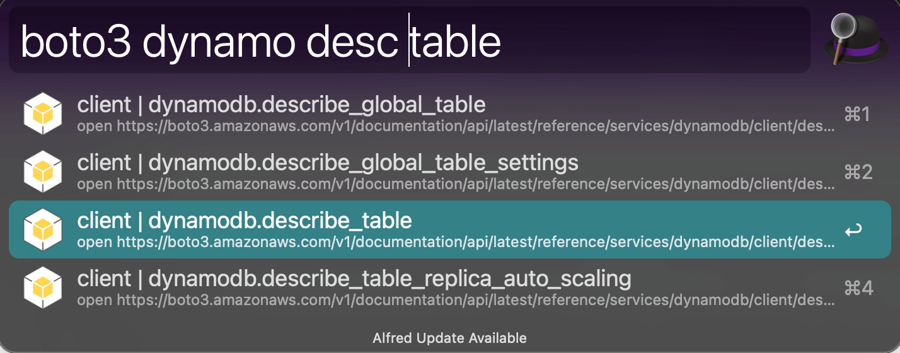

Alfred Workflow Liked App
==============================================================================
`Alfred Workflow <https://www.alfredapp.com/workflows/>`_ 是 Mac 上一款超强的效率工具. 它的核心原理是在文本框里输入字符, 然后用 drop down menu 的方式展示输出, 并选择 item 之后用快捷键与之互动, 打开文件, 打开网页, 运行命令等.

我希望用 QT 来做一个类似的跨平台的小工具. 请阅读下面的源码来学习一个极简的 Alfred Workflow App 是怎么被做出来的.

.. dropdown:: main.py

    .. literalinclude:: ./main.py
       :language: python
       :linenos:

做好了 App 之后, 我就希望将它 package 成可执行文件, 能在其他电脑上运行而不依赖 Python 解释器. 根据 `QT Deployment <https://doc.qt.io/qtforpython-6/deployment/index.html>`_ 文档, ``pyside6-deploy`` 是一个基于 `Nuitka <https://www.nuitka.net/>`_ Python 打包工具的命令行工具, 能自动的将所需要的依赖, 数据文件, QT 的配置文件等打包成一个可执行文件. 在你第一次运行 ``pyside6-deploy main.py`` 的时候, 它会自动生成一个默认配置的 ``pysidedeploy.spec`` 文件. 这个配置文件可以用来调整打包的细节. 其中有一个坑是, 我的主力开发环境是 Mac + Pyenv 中的 Python, Nuitka 会报错, 需要加上 ``--static-libpython=no`` 参数. 这个参数需要被写入到 ``pysidedeploy.spec`` 文件中.

最终打包的命令就是:

.. code-block:: bash

    pyside6-deploy main.py -c pysidedeploy.spec
